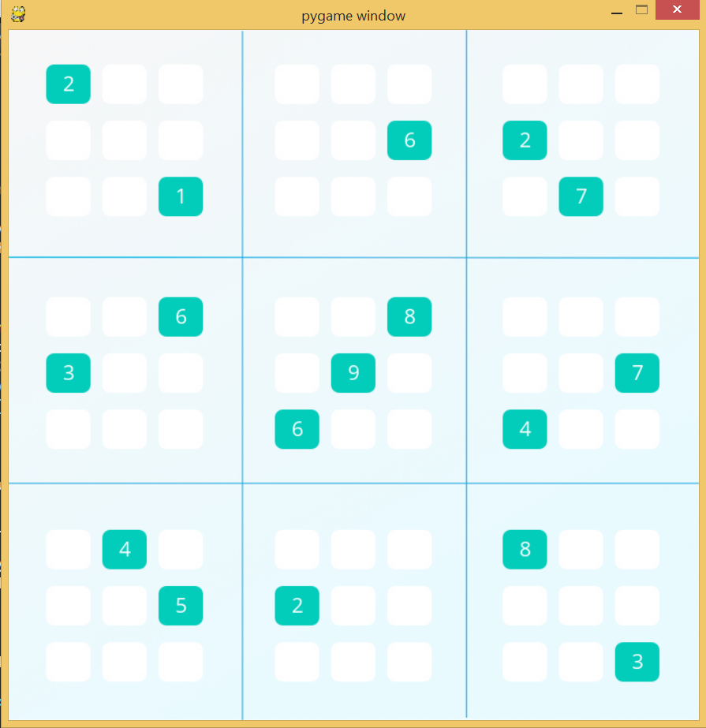
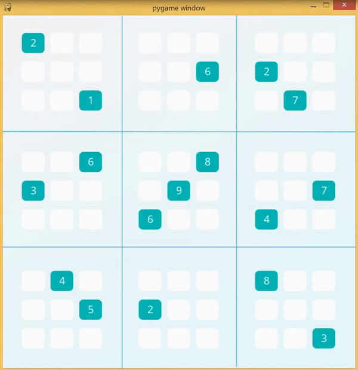

# Solve Sudoku with Artificail Intelligence

<a href="https://youtu.be/jCOnO2_pkOA"></a>

<a href="https://youtu.be/jCOnO2_pkOA"></a>

## Overview

In this project, Sudoku-solving agent was developed to solve _diagonal_ Sudoku puzzles. A diagonal Sudoku puzzle is identical to traditional Sudoku puzzles with the added constraint that the boxes on the two main diagonals of the board must also contain the digits 1-9 in each cell (just like the rows, columns, and 3x3 blocks).

## Quickstart Guide

### Activate the aind environment (Windows)

    `> activate aind`

### Run the code & visualization

    `(aind)$ python solution.py`

### Run the local test suite

    `(aind)$ python -m unittest -v`

1. Run the following command from inside the project folder in your terminal to verify that your system is properly configured for the project. You should see feedback in the terminal about failed test cases -- which makes sense because you haven't implemented any code yet. You will reuse this command later to execute your **local** test cases.

    `$ python -m unittest -v`

1. Add the two new diagonal units to the `unitlist` at the top of solution.py. Re-run the local tests with `python -m unittest` to confirm your solution. 

2. `eliminate()`, `only_choice()`, `reduce_puzzle()`, `naked_twins()`, and `search()` was implemented as functions in the `solution.py` file. If new strategy is added, it needed to be inserted in `reduce_puzzle()`, `reduce_puzzle` will updates the sudoku values with all strategies. 

3. Customized test cases: To further test your code, you can put your test case in `tests/test_solution.py` to confirm your solution. 

Define the input and output of your test cases in `tests/test_solution.py` 
```python
class Test_your_strategy(unittest.TestCase):
	"""
    test_case_before_applying_strategy = {'I6': '4', 'H9': '3, ..., D4': '237', 'D5': '347'}
    possible_solutions = [
        {'G7': '6', 'G6': '3'..., 'D3': '79', 'D1': '5'},   # solution 1
        {'I6': '4', 'H9': '3',..., 'B9': '4', 'D1': '5'}	# solution 2
        ]

    def test_your_strategy(self):    
        self.assertTrue(solution.your_strategy_in_solution_py(self.test_case_before_applying_strategy) in self.possible_solutions,
                        "Your strategy function produced an unexpected board.")
	"""

Define your strategy in `solution.py`
```python
def your_strategy_in_solution_py(values):
    # your strategy
    return values
```

## Visualization

Pygame package needed to installed. The detail of pygame can be found in [pygame documentation](http://www.pygame.org/download.shtml)

```python
conda install -c cogsci pygame  
```

Running `python solution.py` will automatically attempt to track and reconstruct your puzzle solution progress for visuzalization.

## Running unittest with typical test directory structure

To run the `unittest`, we can use command line interface which will add the directory to the `sys.path`, so you don't have to (done in the `TestLoader` class).

Directory structure EX 1:
```
new_project
├── Suduku_module.py
└── test_Suduku_module.py
```
You can just run:

```bash
$ cd new_project
$ python -m unittest test_Suduku_module
```

Directory structure EX 2:
```
new_project
├── Suduku_module
│   ├── __init__.py         # make it a package
│   └── Suduku_module.py
└── test
    ├── __init__.py         # also make test a package
    └── test_Suduku_module.py
```

And in the test modules inside the test package, you can import the Suduku_module package and its modules as usual:

```python
# import the package
import Suduku_module

# import the Suduku_module module
from Suduku_module import Suduku_module

# or an object inside the Suduku_module module
from Suduku_module.Suduku_module import my_object
```

Running a single test module:

To run a single test module, in this case `Suduku_module.py`:

```bash
$ cd new_project
$ python -m unittest test.Suduku_module
```
Just reference the test module the same way you import it.

Running a single test case or test method:

Also you can run a single TestCase or a single test method:

```bash
$ python -m unittest test.Suduku_module.SudukuTestCase
$ python -m unittest test.Suduku_module.SudukuTestCase.test_method
```
Running all tests:

You can also use `unittest discovery` which will discover and run all the tests for you, they must be modules or packages named `test*.py` (can be changed with the `-p`, `--pattern` flag):

```python
$ cd new_project
$ python -m unittest discover
```
This will run all the `test*.py` modules inside the `test` package.

##　Exporting the directory tree of a folder in Windows

1. To open the Command Prompt directly at the folder you are interested in, type `cmd` in the address bar of Windows File Explorer and press Enter , 
2. type: `tree /a /f > output.txt`